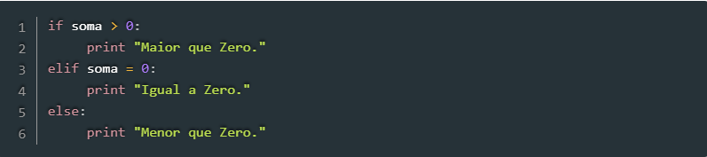
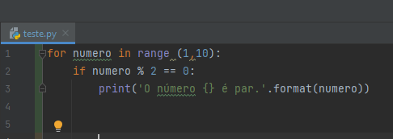
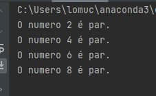
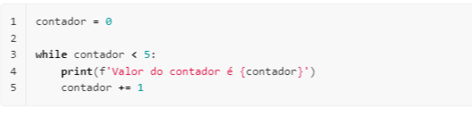

# Python---Mundo-II
Repositório criado para os exercicíos do segundo curso de Python do Curso em Vídeo com o professor Gustavo Guanabara.
Continuação do Mundo I.

O segundo mundo apresenta as estruturas de repetição, muito importantes para qualquer linguagem, o professor explica sobre os comandos if, else, for e while e suas usabilidades. 
 
 [Curso em vídeo - Python Mundo II](https://www.youtube.com/watch?v=nJkVHusJp6E&list=PLHz_AreHm4dk_nZHmxxf_J0WRAqy5Czye)
 
 1. Condições Aninhadas (IF - ELIF)
 2. FOR 
 3. WHILE 
 
 ## 1 - Condições Aninhadas (IF - ELIF)

Estruturas Codicionais Aninhadas são várias condições em cascatas, ou seja, um IF dentro de outro IF. Essa estrutura nos permite tem maais de duas opções de escolha dentro do nosso programa. No exemplo a seguir teremos três escolha, caso a soma seja maior que zero, caso seja igual a zero ou menor que zero:

## 2 - FOR

O comando Python for é uma das estruturas de repetições disponíveis na linguagem que permite a execução de um mesmo comando até que uma determinada condição seja atendida. Na linguagem Python, ela é utilizada para percorrer elementos em sequência, como uma string, uma lista, uma tupla ou objetos iteráveis. 

#### Retornando uma sequência de números: range().

A função range() retorna uma série de números consecutivos. Por padrão, ela inicia no número 0 e é incrementada adicionando 1. O comando range(4), por exemplo, retornará o seguinte valor : “0, 1, 2, 3”, pois ao chegar ao número 4, o loop será concluído. A sintaxe da função range() é:

         range(inicio, parada, incremento)
   
No qual:

início: é um valor opcional e corresponde a partir de qual número o range será iniciado;

parada: é um valor obrigatório e indica o número de parada do range;

incremento: é opcional e indica o valor que queremos adicionar entre um item e outro.   

A função range() é utilizada na estrutura de repetição for para executarmos um determinado conjunto de instruções pela quantidade de vezes indicadas na função. Veja um exemplo:

Resultado:

No código acima, utilizamos a função range() para descobrir os números pares em um determinado intervalo numérico. Perceba que no resultado do processamento o número 10 não foi listado. Como mencionamos, na função range() o valor 10 corresponde ao ponto de parada do loop, então, ele só irá considerar até o número 9.
   
## 3 - WHILE

A condição while(enquanto) em Python é usado para repetir um bloco de código, desde que a expressão de teste (condição) seja verdadeira. Geralmente usamos o while quando não sabemos o número de vezes que precisaremos repetir esse bloco.

No while, a expressão de teste é verificada primeiro. Se a expressão inserida for TRUE(verdadeira) então o bloco de comando do while será executado. Após uma repetição, a expressão de teste é verificada novamente. Esse processo continua até que a expressão inserida seja False(falsa).

Vamos entender melhor com um exemplo:

